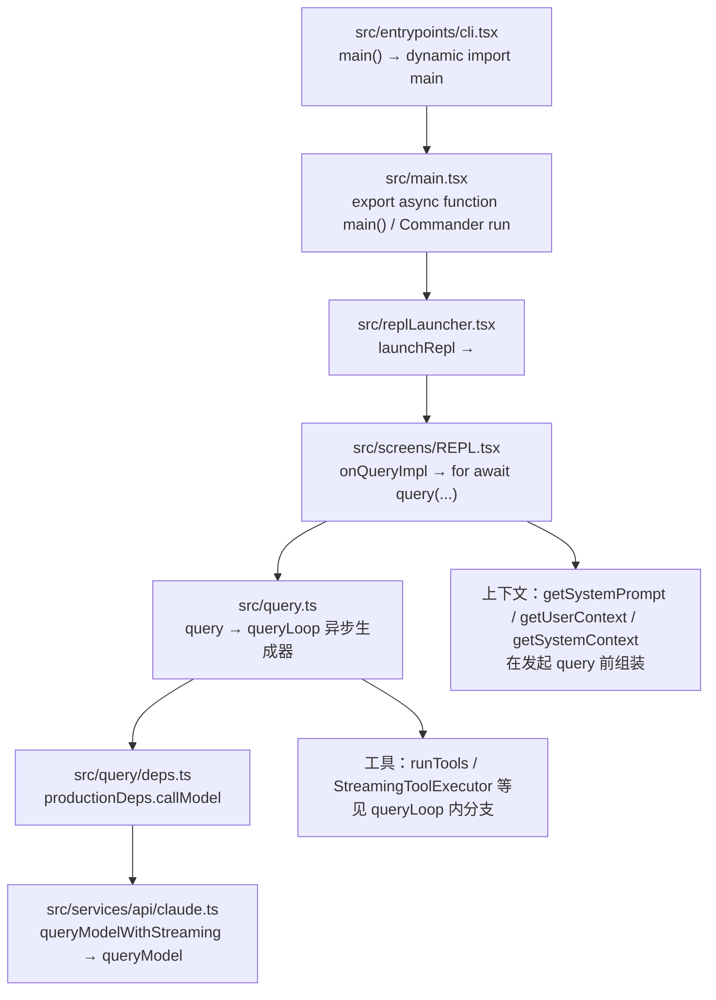

# Quickstart：对话执行链路与断点调试

本文面向本仓库（Claude Code 逆向源码）的**本地开发调试**，目标是用断点串起「一次用户输入 → 模型流式响应 → 工具执行 → 下一轮」在源码中的调用关系。行号随提交可能略有偏移，以**符号（函数/导出）**为准；需要精确行号时在 IDE 内跳转。

---

## 1. 环境前置

| 项 | 说明 |
|----|------|
| 运行时 | **Bun**（`>=1.2.0`），见根目录 `package.json` `engines` |
| 依赖 | 仓库根目录执行 `bun install` |
| 日常开发 | `bun run dev`（`scripts/dev.ts` 会注入 `MACRO` define 与默认 `--feature`） |
| 架构说明 | 根目录 `CLAUDE.md`：入口、`query` 循环、工具、Feature Flag |

调试交互式 TUI 时，使用带 **Inspector** 的开发命令（见下节），不要用纯 `bun run dev` 再指望无配置附加调试。

---

## 2. 启动调试（推荐：Inspect + Attach）

### 2.1 启动带调试端口的进程

`package.json` 已提供：

```bash
bun run dev:inspect
```

等价于使用固定 WebSocket 路径的 `--inspect-wait` 再跑 `scripts/dev.ts`（与 `.vscode/launch.json` 里 `url` 一致）。

含义：

- 进程会**等待**调试器连接后再继续（`--inspect-wait`），避免错过启动阶段断点。
- 连接前终端可能看似「卡住」，属预期行为：先在 IDE 里 **Attach**。

### 2.2 VS Code / Cursor 附加调试

仓库已包含 `.vscode/launch.json`，其中 **「Attach to Bun (TUI debug)」** 通过 WebSocket 附加到上述端口。

操作顺序：

1. 终端执行 `bun run dev:inspect`。
2. 在 IDE 中运行该 Attach 配置。
3. 连接成功后，CLI 继续启动；此时可在下文文件中下断点。

若你改了 inspect 的 host/port/path，需同步修改 `launch.json` 的 `url`。

### 2.3 无 TUI 的简化路径（可选）

管道/打印模式可避开 Ink 全屏，便于只看「一轮 API」逻辑：

```bash
echo "say hello" | bun run src/entrypoints/cli.tsx -p
```

（开发时仍建议与 `dev:inspect` 同方式注入宏与 feature；需要时可自行组合 `bun --inspect-wait=...` 与 `scripts/dev.ts` 的参数。）

---

## 3. 一次「对话轮次」在源码中的主链路

下面是一条**典型交互会话**中，从进程入口到 Agentic 循环的路径（与 `docs/conversation/the-loop.mdx` 描述一致，更偏调试落点）。



**层次说明（调试时脑中要有这张分层）：**

1. **进程与 CLI**：`cli.tsx` 做 fast-path，再 `import('../main.jsx')` 实际进入 `main.tsx`（Bun/TS 解析为 `main.tsx`）。
2. **交互 UI**：`replLauncher.tsx` 挂载 `App` + `REPL`。
3. **单轮提交**：`REPL.tsx` 里在拼好 `systemPrompt`、`userContext`、`systemContext` 和 `toolUseContext` 后调用 `query()`。
4. **核心循环**：`query.ts` 的 `query` / `queryLoop` 负责多轮「请求 → 流式处理 → 工具 → 再请求」。
5. **真实 HTTP/SDK**：`query/deps.ts` 将 `callModel` 指向 `services/api/claude.ts` 的 `queryModelWithStreaming`。

---

## 4. 推荐断点清单（按阅读顺序）

下表用于**第一次**跟一条完整用户消息；可按需删减。建议在 IDE 用「符号搜索」定位函数。

| 顺序 | 文件 | 符号 / 位置 | 观察什么 |
|------|------|----------------|----------|
| 1 | `src/entrypoints/cli.tsx` | `async function main`，动态 `import('../main.jsx')` 之后、`await cliMain()` | 确认进入完整 CLI，而非 `--version` 等 fast-path |
| 2 | `src/main.tsx` | `export async function main` | Commander 解析、初始化、最终走到 `launchRepl` 的分支（条件较多，可配合调用栈） |
| 3 | `src/replLauncher.tsx` | `launchRepl` | React 树挂载点，`App` / `REPL` props |
| 4 | `src/screens/REPL.tsx` | `onQueryImpl` 内 `queryCheckpoint('query_query_start')` 附近、`for await (const event of query({...}))` | **用户一轮请求的真正入口**：`messages`、`systemPrompt`、`canUseTool`、`toolUseContext` |
| 5 | `src/context.ts` | `getUserContext` / `getSystemContext`（如需要） | 注入到 API 侧带的上下文字符串（memo 缓存，注意是否命中缓存） |
| 6 | `src/query.ts` | `export async function* query`、`async function* queryLoop` 入口与 `while (true)` 循环体 | Agentic 多轮迭代、`messages` 如何被压缩与更新 |
| 7 | `src/query/deps.ts` | `productionDeps` | 确认 `callModel` → `queryModelWithStreaming` |
| 8 | `src/services/api/claude.ts` | `queryModelWithStreaming`、`queryModel`（内部实现） | 流式事件、模型名、请求参数如何构建 |
| 9 | `src/query.ts` | `queryLoop` 内调用 `deps.callModel`、`runTools` / `StreamingToolExecutor` 相关分支 | **工具调用**如何进入、结果如何写回 `messages` |
| 10 | `src/services/tools/toolOrchestration.ts` | `runTools`（如走非流式聚合路径） | 工具并行/串行、权限与结果块 |

**权限与 UI**：若关心「弹窗是否允许工具」，在 `hooks/useCanUseTool` 与 `src/components/permissions/` 相关流程设断，并从 `REPL` 的 `canUseTool` 传入链向上追。

---

## 5. 辅助：query 性能检查点

`src/utils/queryProfiler.ts` 的 `queryCheckpoint` 在 `REPL` 与 `query` 路径中打点（例如 `query_query_start`、`query_end`）。调试时可：

- 在 `queryCheckpoint` 内下断，根据字符串区分阶段；
- 或临时在调用处加日志（仅本地，提交前还原）。

---

## 6. 与文档对照

| 文档 | 用途 |
|------|------|
| `docs/conversation/the-loop.mdx` | `queryLoop` 各阶段、终止/恢复条件，与 `src/query.ts` 对照阅读 |
| `docs/conversation/streaming.mdx` | 流式语义（若存在） |
| `CLAUDE.md` | 命令、架构、Feature Flag、`bun:bundle` 的 `feature()` |

---

## 7. 常见问题

**Q：Attach 后进程不继续？**  
A：确认使用 `dev:inspect`（`--inspect-wait`），并先启动 Attach 再等待 CLI 继续。

**Q：断点不进 `query.ts`？**  
A：确认当前路径是交互 `REPL` 且本轮 `shouldQuery === true`（例如被 slash 命令短路时不会进 `query`）。

**Q：Feature 与线上一致吗？**  
A：`scripts/dev.ts` 默认启用部分 feature；未设置 `FEATURE_*` 时 `feature()` 可能仍为 false（见 `CLAUDE.md`）。对比行为时注意环境变量。

---

*文档版本与仓库同步；调试入口以 `package.json` 的 `dev:inspect` 与 `.vscode/launch.json` 为准。*
