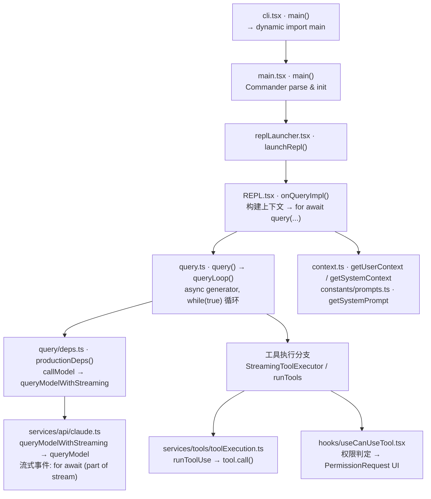

# Quickstart：对话执行链路与断点调试

本文面向本仓库（Claude Code 逆向源码）的**本地开发调试**，目标是用断点串起「一次用户输入 → 模型流式响应 → 工具执行 → 下一轮」在源码中的调用关系。行号随提交可能略有偏移，以**符号（函数/导出）**为准；需要精确行号时在 IDE 内跳转。

---

## 1. 环境前置

| 项 | 说明 |
|----|------|
| 运行时 | **Bun**（`>=1.2.0`），见根目录 `package.json` `engines` |
| 依赖 | 仓库根目录执行 `bun install` |
| 日常开发 | `bun run dev`（`scripts/dev.ts` 会注入 `MACRO` define 与默认 `--feature`） |
| 架构说明 | 根目录 `CLAUDE.md`：入口、`query` 循环、工具、Feature Flag |

调试交互式 TUI 时，使用带 **Inspector** 的开发命令（见下节），不要用纯 `bun run dev` 再指望无配置附加调试。

---

## 2. 启动调试（推荐：Inspect + Attach）

### 2.1 启动带调试端口的进程

`package.json` 已提供：

```bash
bun run dev:inspect
```

等价于使用固定 WebSocket 路径的 `--inspect-wait` 再跑 `scripts/dev.ts`（与 `.vscode/launch.json` 里 `url` 一致）。

含义：

- 进程会**等待**调试器连接后再继续（`--inspect-wait`），避免错过启动阶段断点。
- 连接前终端可能看似「卡住」，属预期行为：先在 IDE 里 **Attach**。

### 2.2 VS Code / Cursor 附加调试

仓库已包含 `.vscode/launch.json`，其中 **「Attach to Bun (TUI debug)」** 通过 WebSocket 附加到上述端口。

操作顺序：

1. 终端执行 `bun run dev:inspect`。
2. 在 IDE 中运行该 Attach 配置。
3. 连接成功后，CLI 继续启动；此时可在下文文件中下断点。

若你改了 inspect 的 host/port/path，需同步修改 `launch.json` 的 `url`。

### 2.3 无 TUI 的简化路径（可选）

管道/打印模式可避开 Ink 全屏，便于只看「一轮 API」逻辑：

```bash
echo "say hello" | bun run src/entrypoints/cli.tsx -p
```

（开发时仍建议与 `dev:inspect` 同方式注入宏与 feature；需要时可自行组合 `bun --inspect-wait=...` 与 `scripts/dev.ts` 的参数。）

---

## 3. 一次「对话轮次」在源码中的主链路

下面是一条**典型交互会话**中，从进程入口到 Agentic 循环的路径。



**层次说明（调试时脑中要有这张分层）：**

| 层 | 文件 | 职责 |
|----|------|------|
| 进程 & CLI | `cli.tsx` | fast-path 分流，`import('../main.jsx')` → `cliMain()` |
| Commander | `main.tsx` | 参数解析、初始化（auth/policy/analytics），走到 `launchRepl` |
| 交互 UI | `replLauncher.tsx` | Ink 挂载 `<App><REPL/>` |
| 单轮提交 | `REPL.tsx` · `onQueryImpl` | 拼 prompt/context/tool → `query()` |
| 核心循环 | `query.ts` · `queryLoop` | 多轮「请求 → 流式 → 工具 → 再请求」 |
| HTTP/SDK | `services/api/claude.ts` | Anthropic SDK 流式调用 |
| 工具执行 | `services/tools/*` | 权限、并行/串行、单工具 `call()` |
| 上下文构建 | `context.ts`, `constants/prompts.ts` | Git status、CLAUDE.md、系统提示 |

---

## 4. 推荐断点清单

### 4.1 Phase A — 进程启动 & CLI 路由（可跳过）

首次调试时可以跳过此阶段，直接从 Phase B 开始。如果你需要理解 feature flag 或 fast-path 分流逻辑，再回来看这里。

| # | 文件 | 行号参考 | 断在哪 | 观察什么 |
|---|------|---------|--------|----------|
| A1 | `src/entrypoints/cli.tsx` | ~42 | `async function main()` 入口 | `process.argv` 参数，确认没有走到 `--version` 等 fast-path |
| A2 | `src/entrypoints/cli.tsx` | ~264 | `const { main: cliMain } = await import('../main.jsx')` | 动态导入 `main.tsx`，此后进入完整 CLI |
| A3 | `src/entrypoints/cli.tsx` | ~266 | `await cliMain()` | 确认 cliMain 执行 |

### 4.2 Phase B — Commander 解析 & REPL 挂载

| # | 文件 | 行号参考 | 断在哪 | 观察什么 |
|---|------|---------|--------|----------|
| B1 | `src/main.tsx` | 函数头 | `export async function main()` | Commander 选项、初始化（auth/policy/sinks），最终走到 `launchRepl` 分支 |
| B2 | `src/replLauncher.tsx` | ~12 | `export async function launchRepl(...)` | `appProps`（初始状态）、`replProps`（初始消息、权限模式）、React 树结构 |

### 4.3 Phase C — 用户消息提交（核心！）

这是「用户按回车发消息」到「进入 query 循环」的关键过渡。

| # | 文件 | 行号参考 | 断在哪 | 观察什么 |
|---|------|---------|--------|----------|
| C1 | `src/screens/REPL.tsx` | ~2665 | `const onQueryImpl = useCallback(async (...) => {` | **入口**。参数：`messagesIncludingNewMessages`, `shouldQuery`, `abortController` |
| C2 | `src/screens/REPL.tsx` | ~2750 | `const toolUseContext = getToolUseContext(...)` | `toolUseContext` 包含工具列表、MCP 客户端、权限上下文、options |
| C3 | `src/screens/REPL.tsx` | ~2772 | `await Promise.all([..., getSystemPrompt(...), getUserContext(), getSystemContext()])` | 并行拉取系统提示 + 用户上下文 + 系统上下文。检查缓存命中情况 |
| C4 | `src/screens/REPL.tsx` | ~2785 | `const systemPrompt = buildEffectiveSystemPrompt({...})` | 最终系统提示组装（含自定义 prompt、append prompt） |
| C5 | `src/screens/REPL.tsx` | ~2797 | `for await (const event of query({...})) {` | **进入 query 循环**！检查传入的完整参数集：`messages`, `systemPrompt`, `userContext`, `systemContext`, `canUseTool`, `toolUseContext` |
| C6 | `src/screens/REPL.tsx` | ~2806 | `onQueryEvent(event)` | 每个流式事件如何更新 UI 状态 |

### 4.4 Phase D — 上下文构建（可选深入）

| # | 文件 | 行号参考 | 断在哪 | 观察什么 |
|---|------|---------|--------|----------|
| D1 | `src/constants/prompts.ts` | ~444 | `export async function getSystemPrompt(...)` | 完整系统提示的构建过程（工具列表、模型能力） |
| D2 | `src/context.ts` | ~116 | `export const getSystemContext = memoize(...)` | Git status 获取。`memoize` 意味着后续调用命中缓存 |
| D3 | `src/context.ts` | ~155 | `export const getUserContext = memoize(...)` | CLAUDE.md 发现与加载逻辑 |

### 4.5 Phase E — query 核心循环（最重要！）

这是整个 Agentic 系统的心脏。一次用户消息可能在此循环中迭代多轮（模型请求 → 工具执行 → 再请求）。

| # | 文件 | 行号参考 | 断在哪 | 观察什么 |
|---|------|---------|--------|----------|
| E1 | `src/query.ts` | ~219 | `export async function* query(params)` | 异步生成器入口，内部 `yield* queryLoop(params, ...)` |
| E2 | `src/query.ts` | ~241 | `async function* queryLoop(params, ...)` | 实际循环体。`params` 解构出 `systemPrompt`, `canUseTool`, `messages` 等不可变参数 |
| E3 | `src/query.ts` | ~268 | `let state: State = { messages, toolUseContext, ... }` | **循环状态初始化**。每轮迭代会更新此 state |
| E4 | `src/query.ts` | ~307 | `while (true) {` | **主循环入口**！每次断在这里可看到当前轮的完整 `state`（messages、turnCount、autoCompactTracking） |
| E5 | `src/query.ts` | ~339 | `queryCheckpoint('query_fn_entry')` | 性能检查点，标志一轮迭代开始 |
| E6 | `src/query.ts` | ~413-468 | `deps.microcompact` / `deps.autocompact` | **消息压缩**。microcompact 精简 tool 结果；autocompact 在 token 超限时自动摘要 |
| E7 | `src/query.ts` | ~560 | `queryCheckpoint('query_setup_start')` | 流式工具执行器创建、模型选择 |
| E8 | `src/query.ts` | ~562 | `new StreamingToolExecutor(...)` | 流式工具执行器实例化（若启用） |
| E9 | `src/query.ts` | ~652 | `queryCheckpoint('query_api_loop_start')` | API 请求即将开始 |

### 4.6 Phase F — 模型 API 调用 & 流式处理

| # | 文件 | 行号参考 | 断在哪 | 观察什么 |
|---|------|---------|--------|----------|
| F1 | `src/query.ts` | ~659 | `for await (const message of deps.callModel({...})) {` | **核心 API 调用**！参数中包含 `messages`（含 userContext）、`systemPrompt`、`tools`、`model`。这是请求发出的地方 |
| F2 | `src/query/deps.ts` | ~33 | `export function productionDeps()` | 确认 `callModel` 指向 `queryModelWithStreaming` |
| F3 | `src/services/api/claude.ts` | ~739 | `export async function* queryModelWithStreaming({...})` | 对外流式 API 入口。内部调用 `queryModel()` |
| F4 | `src/services/api/claude.ts` | ~1004 | `async function* queryModel(...)` | 实际构建 Anthropic SDK 请求参数的地方。检查 `model`、`system`、`messages`、`tools` |
| F5 | `src/services/api/claude.ts` | ~1927 | `for await (const part of stream) {` | **流式事件主循环**！每个 SSE chunk 在此处理。`part.type` 包含 `content_block_start`、`content_block_delta`、`message_stop` 等 |

### 4.7 Phase G — 工具执行

当模型返回 `tool_use` block 时，进入工具执行阶段。

| # | 文件 | 行号参考 | 断在哪 | 观察什么 |
|---|------|---------|--------|----------|
| G1 | `src/query.ts` | ~1383-1385 | `streamingToolExecutor.getRemainingResults()` 或 `runTools(...)` | **工具执行总入口**。流式模式用 `StreamingToolExecutor`，非流式用 `runTools` |
| G2 | `src/query.ts` | ~1387 | `for await (const update of toolUpdates) {` | 消费工具结果，写入 `toolResults` 数组 |
| G3 | `src/query.ts` | ~1412 | `queryCheckpoint('query_tool_execution_end')` | 工具执行完成 |
| G4 | `src/services/tools/toolOrchestration.ts` | ~19 | `export async function* runTools(...)` | 非流式路径：按 `partitionToolCalls` 分组后串行/并行执行 |
| G5 | `src/services/tools/toolOrchestration.ts` | ~118 | `async function* runToolsSerially(...)` | 写操作类工具（Bash、FileEdit）走串行 |
| G6 | `src/services/tools/toolOrchestration.ts` | ~152 | `async function* runToolsConcurrently(...)` | 只读工具（FileRead、Grep）走并行，最大并发 `MAX_TOOL_USE_CONCURRENCY`（默认 10） |
| G7 | `src/services/tools/StreamingToolExecutor.ts` | ~40 | `export class StreamingToolExecutor` | 流式模式工具执行器。`addTool()` 在流式接收到 tool_use block 时立即开始执行 |
| G8 | `src/services/tools/StreamingToolExecutor.ts` | ~76 | `addTool(block, assistantMessage)` | 工具加入执行队列的入口 |
| G9 | `src/services/tools/toolExecution.ts` | 函数头 | `runToolUse(...)` | **单个工具执行**。内部调用 `tool.call()`、处理权限检查结果、记录时间/分析 |

### 4.8 Phase H — 权限判定

权限系统决定工具是否可以执行。

| # | 文件 | 行号参考 | 断在哪 | 观察什么 |
|---|------|---------|--------|----------|
| H1 | `src/hooks/useCanUseTool.tsx` | ~28 | `function useCanUseTool(...)` | 权限 hook 入口。内部创建 `PermissionContext`，调用 `hasPermissionsToUseTool()` |
| H2 | `src/hooks/useCanUseTool.tsx` | ~37 | `hasPermissionsToUseTool(tool, input, ...)` | 静态规则判定（config/session rules）。`allow` → 直接放行；`deny` → 拒绝；`ask` → 弹窗 |
| H3 | `src/hooks/useCanUseTool.tsx` | ~64 | `switch (result.behavior)` 的 `"ask"` 分支 | 需要用户确认时走此分支。调用 `handleInteractivePermission` 弹出确认 UI |
| H4 | `src/components/permissions/PermissionRequest.tsx` | ~146 | `export function PermissionRequest(...)` | 权限弹窗 UI 组件 |

### 4.9 Phase I — 循环继续 / 终止判定

query 循环的 continue/return 逻辑决定是否进行下一轮。

| # | 文件 | 行号参考 | 断在哪 | 观察什么 |
|---|------|---------|--------|----------|
| I1 | `src/query.ts` | 循环尾部 | `needsFollowUp` 判定后的 `state = { ... }` 赋值 | 如果有工具结果（`toolResults.length > 0`），`needsFollowUp = true`，循环继续 |
| I2 | `src/query.ts` | `return` 语句 | `return { reason: '...' }` | 终止原因：`end_turn`（正常结束）、`blocking_limit`（token 超限）、`max_turns`（达到最大轮次） |
| I3 | `src/screens/REPL.tsx` | ~2815 | `queryCheckpoint('query_end')` | query 循环结束后回到 REPL，清理状态 |

---

## 5. 断点使用策略

### 5.1 最小断点集（首次推荐）

如果你只想理解一条消息的完整生命周期，设以下 **5 个断点**即可：

1. **C5** — `REPL.tsx` 的 `for await (const event of query({...}))` — 消息提交入口
2. **E4** — `query.ts` 的 `while (true) {` — 循环迭代入口
3. **F1** — `query.ts` 的 `for await (const message of deps.callModel({...}))` — API 请求
4. **G1** — `query.ts` 的工具执行入口 — `streamingToolExecutor.getRemainingResults()` 或 `runTools(...)`
5. **I1** — `query.ts` 循环尾部 — 是否继续下一轮

### 5.2 深入 API 层

在最小集基础上加：

6. **F4** — `claude.ts` 的 `queryModel(...)` — 看 SDK 请求参数
7. **F5** — `claude.ts` 的 `for await (const part of stream)` — 看流式事件

### 5.3 深入工具 & 权限

在最小集基础上加：

8. **G9** — `toolExecution.ts` 的 `runToolUse(...)` — 单工具执行
9. **H1** — `useCanUseTool` — 权限判定过程
10. **H2** — `hasPermissionsToUseTool` — 静态规则匹配

### 5.4 深入上下文构建

11. **D1** — `getSystemPrompt(...)` — 系统提示如何生成
12. **D2/D3** — `getSystemContext` / `getUserContext` — 注入到 API 的额外上下文

---

## 6. 关键变量速查

调试时最常需要观察的变量/字段：

| 位置 | 变量 | 含义 |
|------|------|------|
| `onQueryImpl` | `messagesIncludingNewMessages` | 包含新用户消息的完整消息列表 |
| `onQueryImpl` | `toolUseContext` | 当前轮的完整工具上下文（工具列表、MCP、权限、abortController） |
| `onQueryImpl` | `systemPrompt` | 最终发送给 API 的系统提示 |
| `queryLoop` | `state.messages` | 循环内维护的消息数组（会被压缩/更新） |
| `queryLoop` | `state.turnCount` | 当前迭代轮次 |
| `queryLoop` | `messagesForQuery` | 经过 compactBoundary 裁剪后的实际发送消息 |
| `queryLoop` | `toolUseBlocks` | 当前轮模型返回的所有 tool_use block |
| `queryLoop` | `needsFollowUp` | 是否有工具调用需要继续迭代 |
| `queryLoop` | `assistantMessages` | 当前轮收到的助手消息 |
| `queryLoop` | `toolResults` | 工具执行结果 |
| `callModel` 参数 | `options.model` | 实际使用的模型名 |
| `queryModel` | `stream` | Anthropic SDK 的流对象 |
| `runToolUse` | `tool.name` + `input` | 正在执行的工具和参数 |
| `hasPermissionsToUseTool` 返回 | `result.behavior` | `"allow"` / `"deny"` / `"ask"` |

---

## 7. 完整对话生命周期（图解）

```
用户按回车
    │
    ▼
REPL.tsx: onQueryImpl()
    │  构建 toolUseContext
    │  await Promise.all([getSystemPrompt, getUserContext, getSystemContext])
    │  buildEffectiveSystemPrompt()
    │
    ▼
query.ts: query() → queryLoop()
    │
    ├──── while (true) { ──────────────────────────────────┐
    │       │                                               │
    │       ├─ microcompact / autocompact (消息压缩)        │
    │       ├─ new StreamingToolExecutor (若启用)            │
    │       │                                               │
    │       ├─ deps.callModel({...})                        │
    │       │    │                                           │
    │       │    ▼                                           │
    │       │  claude.ts: queryModelWithStreaming()          │
    │       │    │                                           │
    │       │    ▼                                           │
    │       │  claude.ts: queryModel()                       │
    │       │    │ 构建 Anthropic SDK 请求参数               │
    │       │    │ 调用 SDK stream                          │
    │       │    ▼                                           │
    │       │  for await (part of stream) {                  │
    │       │    yield StreamEvent / AssistantMessage        │
    │       │  }                                            │
    │       │                                               │
    │       ├─ 流式处理 tool_use blocks                     │
    │       │    │ StreamingToolExecutor.addTool()           │
    │       │    │ (边流边执行)                              │
    │       │                                               │
    │       ├─ 工具执行阶段                                 │
    │       │    │                                           │
    │       │    ├─ useCanUseTool() → 权限判定               │
    │       │    │    ├─ allow → 直接执行                    │
    │       │    │    ├─ deny → 返回错误                     │
    │       │    │    └─ ask → 弹出 PermissionRequest UI     │
    │       │    │                                           │
    │       │    ├─ runToolUse() → tool.call()              │
    │       │    │    ├─ BashTool: 执行 shell 命令          │
    │       │    │    ├─ FileEditTool: 编辑文件              │
    │       │    │    ├─ FileReadTool: 读取文件              │
    │       │    │    ├─ GrepTool: 搜索                     │
    │       │    │    └─ AgentTool: 启动子 agent            │
    │       │    │                                           │
    │       │    └─ toolResults 写回 messages                │
    │       │                                               │
    │       ├─ needsFollowUp?                               │
    │       │    ├─ true → state 更新，continue (下一轮)     │
    │       │    └─ false → return { reason: 'end_turn' }   │
    │       │                                               │
    └──────┴───────────────────────────────────────────────┘
    │
    ▼
REPL.tsx: queryCheckpoint('query_end')
    │  resetLoadingState()
    │  等待下一次用户输入
    ▼
```

---

## 8. queryCheckpoint 检查点清单

`src/utils/queryProfiler.ts` 的 `queryCheckpoint(name)` 在关键位置打点，可以在该函数内（~行 69）下**条件断点**来拦截特定阶段：

| 检查点名称 | 位置 | 阶段 |
|-----------|------|------|
| `query_context_loading_start` | REPL.tsx ~2771 | 开始加载上下文 |
| `query_context_loading_end` | REPL.tsx ~2784 | 上下文加载完成 |
| `query_query_start` | REPL.tsx ~2793 | 即将进入 query() |
| `query_fn_entry` | query.ts ~339 | queryLoop 迭代开始 |
| `query_setup_start` | query.ts ~560 | StreamingToolExecutor 创建前 |
| `query_setup_end` | query.ts ~580 | 设置完成 |
| `query_api_loop_start` | query.ts ~652 | API 请求循环开始 |
| `query_api_streaming_start` | query.ts ~658 | 流式调用开始 |
| `query_microcompact_*` | query.ts ~413-426 | 微压缩阶段 |
| `query_autocompact_*` | query.ts ~453-468 | 自动压缩阶段 |
| `query_tool_execution_end` | query.ts ~1412 | 工具执行完成 |
| `query_end` | REPL.tsx ~2815 | 整轮 query 结束 |

**条件断点技巧**：在 `queryCheckpoint` 函数（行 ~69）设断点，条件为 `name === 'query_api_streaming_start'`，可精确拦截到 API 调用前的那一刻。

---

## 9. 调试场景实操

### 场景 A：跟踪一次简单对话（无工具调用）

1. 设断点 C5、E4、F1
2. 在 REPL 中输入 `hi`
3. C5 命中 → 检查 messages 中的用户消息
4. E4 命中 → `turnCount = 1`
5. F1 命中 → 检查发给 API 的完整参数（model、messages、tools）
6. 流式返回，`needsFollowUp = false`，循环退出

### 场景 B：跟踪工具调用（如文件读取）

1. 设断点 C5、E4、F1、G1、G9
2. 输入 `read the file package.json`
3. F1 命中 → 模型请求
4. 模型返回 `tool_use` block（FileReadTool）
5. G1 命中 → 进入工具执行
6. G9 命中 → `tool.name = "Read"`, `input = { file_path: "package.json" }`
7. 工具执行完成，`needsFollowUp = true`
8. E4 再次命中 → `turnCount = 2`，messages 中包含工具结果
9. 模型基于工具结果生成最终回复

### 场景 C：跟踪权限弹窗

1. 设断点 H1、H2、H3
2. 输入需要写操作的指令（如 `create a file test.txt`）
3. H2 命中 → `hasPermissionsToUseTool` 返回 `behavior: "ask"`
4. H3 命中 → 进入交互权限处理
5. 弹出 PermissionRequest UI → 用户点击 Allow/Deny

### 场景 D：跟踪消息压缩

1. 设断点 E6（microcompact/autocompact）
2. 进行多轮对话使 token 积累
3. E6 命中时检查 `autoCompactTracking` 和 token 计数
4. 观察 `messagesForQuery` 在压缩前后的差异

---

## 10. 与文档对照

| 文档 | 用途 |
|------|------|
| `docs/conversation/the-loop.mdx` | `queryLoop` 各阶段、终止/恢复条件，与 `src/query.ts` 对照阅读 |
| `docs/conversation/streaming.mdx` | 流式语义（若存在） |
| `CLAUDE.md` | 命令、架构、Feature Flag、`bun:bundle` 的 `feature()` |

---

## 11. 常见问题

**Q：Attach 后进程不继续？**  
A：确认使用 `dev:inspect`（`--inspect-wait`），并先启动 Attach 再等待 CLI 继续。

**Q：断点不进 `query.ts`？**  
A：确认当前路径是交互 `REPL` 且本轮 `shouldQuery === true`（例如被 slash 命令短路时不会进 `query`）。

**Q：Feature 与线上一致吗？**  
A：`scripts/dev.ts` 默认启用部分 feature；未设置 `FEATURE_*` 时 `feature()` 可能仍为 false（见 `CLAUDE.md`）。对比行为时注意环境变量。

**Q：流式断点太多怎么办？**  
A：`claude.ts` 的 `for await (const part of stream)` 每个 SSE chunk 都会命中，可用条件断点 `part.type === 'content_block_start'` 只拦截新内容块的开始。

**Q：如何看到发送给 API 的完整 request body？**  
A：在 `queryModel`（claude.ts ~1004）的 `stream = await ...` 前设断，检查构建好的 `messages`、`system`、`tools` 参数；或者设 `CLAUDE_CODE_DUMP_PROMPTS=1` 环境变量，会自动保存请求到文件。

**Q：工具串行还是并行执行？**  
A：取决于 `tool.isConcurrencySafe()` 返回值。只读工具（Read、Grep、Glob）返回 `true` → 并行；写操作工具（Bash、FileEdit、FileWrite）返回 `false` → 串行。见 `toolOrchestration.ts` ~91 的 `partitionToolCalls`。

---

*文档版本与仓库同步；调试入口以 `package.json` 的 `dev:inspect` 与 `.vscode/launch.json` 为准。*
